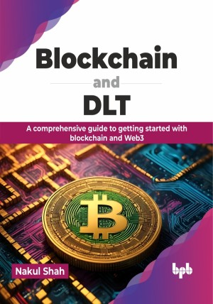

# Blockchain and DLT

Blockchain revolution: Pioneering the next wave of digital innovation

This is the repository for [Blockchain and DLT
](https://bpbonline.com/products/blockchain-and-dlt?variant=43230460969160),published by BPB Publications.

## About the Book
Blockchain secures individual transactions with cryptography, creating a tamper-proof chain. In contrast, distributed ledger technologies cover various technologies that may not adhere strictly to blockchain's specific structure.

We will start the book by defining blockchain elements, comparing it to DLT, exploring security mechanisms, and looking at Bitcoin's history, transactions, wallets, keys, mining, and forensics. Further in the book, we will explore Ethereum's evolution, Ethereum virtual machine, and smart contracts. We will also discover permissioned blockchains with Hyperledger Fabric and understand crypto assets, ERC20, ERC721 tokens, NFTs, and cryptocurrencies. With real-world examples and practical insights, you will gain a solid grasp of the fundamentals and practical applications that make blockchain a game-changer in various industries. 

By the end of this book, you will be equipped with the understanding of blockchain technology, its potential applications, and its impact on the future. You will be able to confidently discuss blockchain concepts and evaluate its potential for your own projects.

## What You Will Learn
• Concept of distributed ledger system and blockchain.

• Concept of consensus and mining in blockchain through the Bitcoin network.

• Understanding Ethereum and develop-deploy smart contracts using different tools and frameworks.

• Exploring permissioned blockchain and Hyperledger Fabric.

• Applying blockchain to different domains such as IoT, AI, and cybersecurity.

